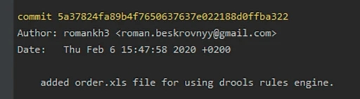

# Инструкция по работе с Git.

## Что такое Git?

## Настройка Git.

## Что говорит Git?

## Основные команды.

## Начало работы с Git.

## Что такое commit?

__*Коммит*__ — это основной объект в управлении контроля версий. Он содержит все изменения за время этого коммита. Коммиты связаны между с собой как односвязный список. 

А именно: 

Есть первый коммит. Когда создается второй коммит, то он (второй) знает, что идет после первого. И таким образом можно отследить информацию. 

Также у коммита есть еще своя информация, так называемые метаданные:
* уникальный идентификатор коммита, по которому можно его найти;
имя автора коммита, который создал его;
дата создания коммита;
комментарий, который описывает, что было сделано во время этого коммита.
Вот как это выглядит:

Для того, чтобы создать commit, нам необходимо указать к нему комментарий. Для этого используется "флажок" -m. Выглядит это так: __git commit -m__ "*какой-то комментарий*"

## Ветки. 

## Как добавить изображение в Git.

